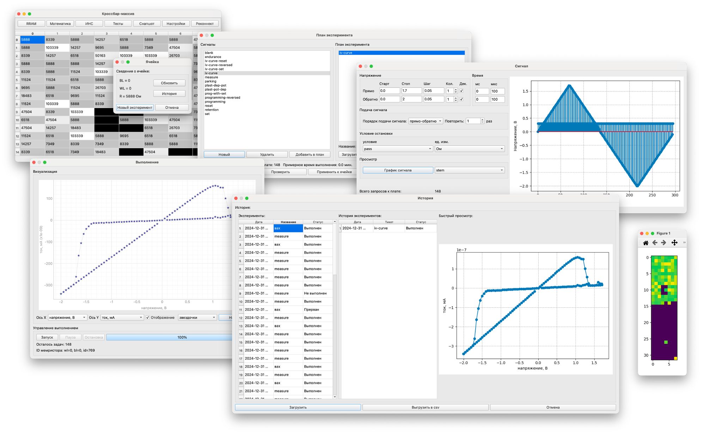

# MemBoard
Memristors are coming!

Данная программа предназначена для работы с мемристорами с использованием плат MemArdBoard и MemRaspBoard. В программе заложен функционал проведения измерений и снятия различных характеристик мемристоров, автоматического тестирования, использования мемристоров в качестве памяти ReRAM, выполнения математических операций и работы с искусственными нейронными сетями. В программе также есть симулятор мемристоров, поэтому с ней можно работать и не имея специальных плат.



## Инструкция

### Установка

Для работы с программой понадобится интерпретатор Python версии не ниже 3.9.6. Для клонирования репозитория выполните команду:

```
git clone git@github.com:neurocomputer/MemBoard.git
```

Далее настройте виртуальное окружение и установите необходимые пакеты:

```
python3 -m venv venv
. venv/bin/activate
python3 -m pip install --upgrade pip
pip install -r requirements.txt
```

### Первый запуск

Для запуска программы используйте файл `main.py`. После запуска программы в директории автоматически создадутся файлы `settings.ini` (содержит необходимые настройки), `base.db` (база данных результатов экспериментов), `app.log` (журнал программы). При работе с программой в режиме симулятора также будут создаваться файлы с расширением `.cb`, содержащие модель массива мемристоров. Инструкция по работе с программой приведена [здесь](https://github.com/neurocomputer/MemBoard/blob/main/docs/README.md).

## Обратная связь
При возникновении вопросов, ошибок и предложений пишите на почту `seach@inbox.ru`.
