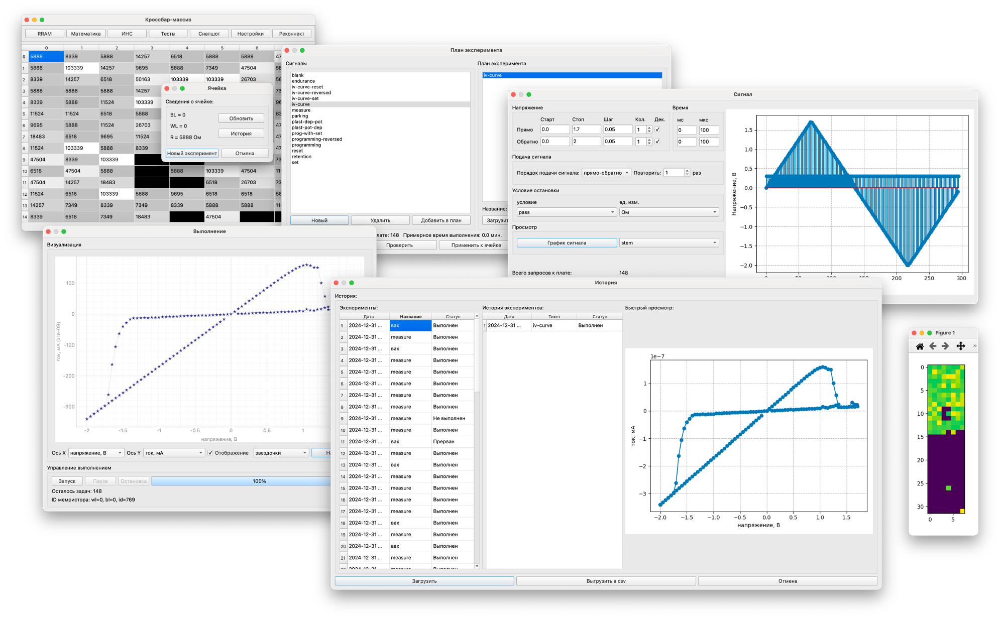

# MemriBoard
Memristors are coming!

This program is designed to work with memristors using the MemArdBoard and MemRaspBoard boards. The program includes the functionality of taking measurements and taking various characteristics of memristors, automatic testing, using memristors as ReRAM memory, performing mathematical operations and working with artificial neural networks. The program also has a memristor simulator, so you can work with it without special boards.



## Instruction

### Installing

To work with the program, you need a Python interpreter with a version of at least 3.9.6. To clone the repository, run the command:

```
git clone git@github.com:neurocomputer/MemBoard.git
```

Next, configure the virtual environment and install the necessary packages:

```
python3 -m venv venv
. venv/bin/activate
python3 -m pip install --upgrade pip
pip install -r requirements.txt
```

### First launching

Use the file 'main.py' to start the program. After starting the program, the files `settings.ini` (contains the necessary settings), `base.db` (database of experimental results), `app.log` (program log) will be automatically created in the directory. When working with the program in simulator mode, files with the extension `.cb` containing the memristor array model will also be created. Instructions for using the program are provided [here](https://github.com/neurocomputer/MemBoard/blob/main/docs/README.md).

### Видеоинструкции
|#|Дата|Описание|Актуальность|Ссылка|
|-|-|-|-|-|
|1|2024.08.19|Общие сведения о программе|Добавлены изменения (см. 3)|[Просмотреть](https://disk.yandex.ru/d/6aityAsjwKoaAQ)|
|2|2024.08.19|Работа с ячейками|Добавлены изменения (см. 3)|[Просмотреть](https://disk.yandex.ru/d/7sABZ-Q9LflIOw)|
|3|2025.02.16|Обновление запуска и истории|Актуально|[Просмотреть](https://disk.yandex.ru/d/A8vl9FCXTl6TPA)|
|~~4~~|~~2025.02.18~~|~~Работа с окном выполнения тестов~~|~~Не актуально (см. 5)~~|[~~Просмотреть~~](https://disk.yandex.ru/d/ZuqAzYHxvj1iMg)|
|5|2025.03.10|Работа с окном выполнения тестов|Актуально|[Просмотреть](https://disk.yandex.ru/d/apkuO8ldtKsBqQ)|
|6|2025.06.12|Работа с окном RRAM|Актуально|[Просмотреть](https://disk.yandex.ru/d/xKnj-qutjzy5mA)|

### Для пользователей Windows
Для запуска программы в Windows доступны собранные exe-файлы. Скачайте архив и распакуйте его. Внутри находятся две папки (`gui`, `tickets`) и файл `main.exe`. При выходе обновлений нужно будет заменять только файл `main.exe`, все остальные данные сохранятся.

|Дата|Ссылка|Комментарий|
|-|-|-|
|2025.02.16|[Скачать zip-архив](https://disk.yandex.ru/d/mRvaQKJZvJ8cKg)||
|2025.02.18|[Скачать zip-архив](https://disk.yandex.ru/d/sDn3gHRMWB_Ngw)|Обновлено тестирование|
|2025.02.28|[Скачать zip-архив](https://disk.yandex.ru/d/0tTmugFL6xE7eQ)|Внесено много исправлений|
|2025.03.10|[Скачать zip-архив](https://disk.yandex.ru/d/xJ0hcCIJJtwVqg)|Обновлено тестирование|

## Обратная связь
При возникновении вопросов, ошибок и предложений пишите на почту `seach@inbox.ru`.
