# MemriBoard Manual

## Table of contents

- [**Product Overview**](#product-overview)
- [**Connecting the crossbar array**](#connecting-the-crossbar-array)
  - [Creating new database entry](#creating-a-database-entry-for-new-crossbar-array)
    - [Settings](#settings)
- [**Main window**](#main-window)
- [**Working with individual cells**](#working-with-individual-cells)
  - [History window](#history-window)
- [**Configuring your experiment**](#configuring-your-experiment)
  - [Signal editing](#signal-editing-window)
    - [Standart pulse sequence](#standart-pulse-sequence)
    - [Terminate condition](#terminate-condition)
- [**Applying the experiment**](#applying-the-experiment)
- [**Testing multiple cells**](#testsing-multiple-cells)

<!-- - [Инференс нейросети](#инференс-нейросети)
- [Демо нейросети](#демо-нейросети)  -->

## Product Overview

The program can run on any operating system with python 3.9 or higher support.

### Connecting the crossbar array

The connection window appears at startup. In it, you can select a crossbar you are working with, COM-port to which the device is connected, or choose the simulation mode.

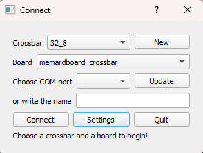

It is possible to add multiple crossbars if the device is used with different crossbars. A separate interaction history log is created for each.

#### Creating a database entry for new crossbar array

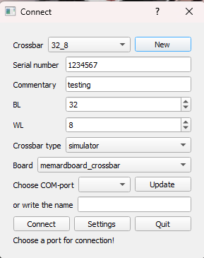

When adding a crossbar array, enter its **serial number**, the number of rows (**BL** &mdash; Bit Line) and columns (**WL** &mdash; Word Line) in the crossbar array (applicable for various architectures and experimental connection), the type of commands (switched, without switching), **crossbar type** (simulator or real), and, if necessary, a comment.

If you are adding a real crossbar, you must first connect the device to the USB port, and specify the port name in the **Choose COM-port** field.
After connecting, a new crossbar is created in memory, or an existing one is loaded, and a view and interaction window opens.

#### Settings

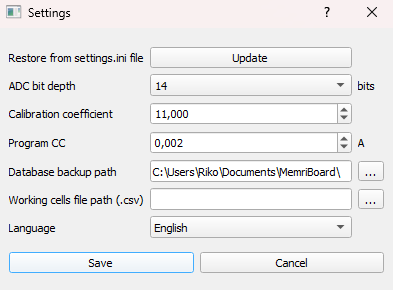

- **Update** the configutation from settings.ini.
- Selection of **ADC bit depth**: 10 bits (Arduino ADC) or 14 bits (external ADC, oversampling).
- Adjustment of **calibration coefficient**.
- Adjustment of the software **current compliance (CC)** (works by predicting the current of the next pulse, based on last measured resistance).

## Main window

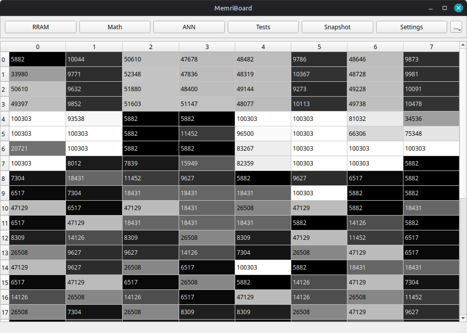

Main window has a table which displays resistances of the memory cells. At the top of the window, there are general functionality buttons:

- **RRAM** for working with the crossbar array as a memory bank.
- **Math** for matrix multiplication.
- **ANN** for working with neural networks (WIP).
- [**Tests**](#testsing-multiple-cells) to conduct general crossbar testing on multiple cells.
- **Snapshot** shows a color map of the resistances.
- [**Settings**](#settings).

## Working with individual cells

In addition to the general functionality, it is possible to work with each cell separately. To open the cell menu, double-click on it with the left mouse button.

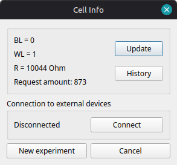

The window that opens displays the basic information about the cell and contains basic functionality for working with it:

- **Update** &mdash; read the resistance of the cell.
- [**History**](#history-window) &mdash; get the journal of all experiments conducted on the cell.
- [**New experiment**](#configuring-your-experiment) &mdash; create new experiment plan.

### History window

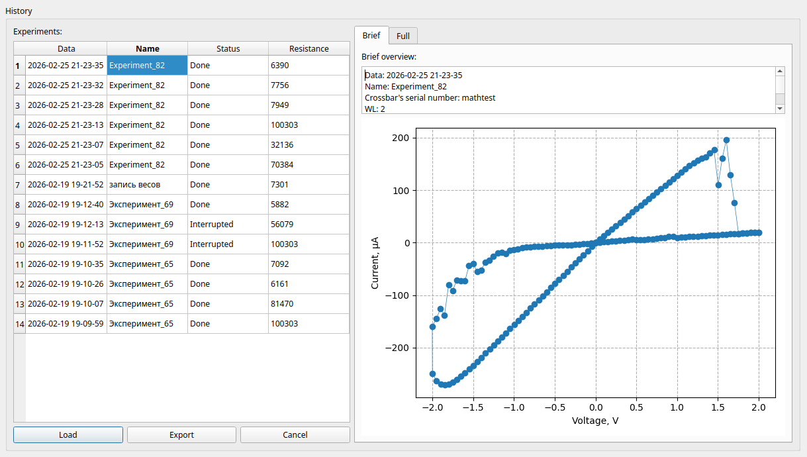

The window displays all experiments performed on the cell. By clicking on the experiment you can get it's brief overview (**Brief** tab on the right side of the window) or ***export measurement data*** to csv (**Full** tab on the right side of the window, then press **Export to csv**). The data is exported separately for each part of the experiment (ticket).
You can **Export** the experiment plan as a single ticket via **Export** button in the bottom left part of the window.
You can **Load the experiment** to repeat it: [Experiment configuration](#configuring-your-experiment) window will open. The **Load** button is in the bottom left of the window.

## Configuring your experiment

Experiment configuration window can be opened via [Cell info](#working-with-individual-cells) window or via [Tests](#testsing-multiple-cells) window.

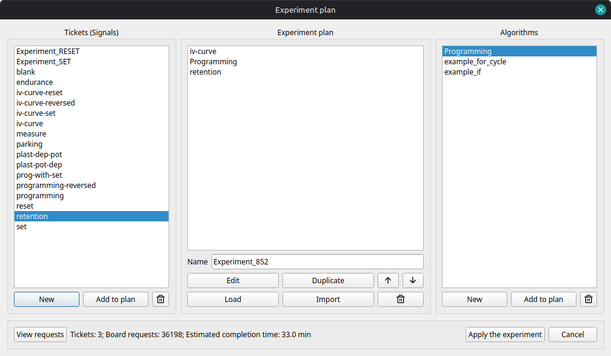

The window allows you to create a new experiment with a cell. It is made up of tickets &mdash; preset experiments, such as iv-curve, endurance, programming, etc. You can **add** multiple tickets from left side of the window to the experiment plan (**Add to plan** button), or you can create a new ticket (**New** button in the bottom left corner).
The **Load** button on the right side of the window allows you to load a ticket that was previously applied to one of the cells. All parameters of that ticket will be loaded to the experiment.
You can also directly **import** tickets from a *.json* file.
You can enter the experiment **name** in the lower right part of the window.

Preset tickets, available by default, are:

- *blank* &mdash; empty ticket that all.
- *endurance* &mdash; standart endurance test for RRAM cells.
- *iv-curve*, *iv-curve-set*, *iv-curve-reset*, *iv-curve-reversed* &mdash; tickets for measuring pulsed IV-curves.
- *measure* &mdash; ticket for measuring cell resistance.
- *programming*, *programming-reversed* &mdash; for programming specific resistance (see [Terminate condition](#terminate-condition)).
- *retention* &mdash; ticket for measuring the retention of the resistive states.
- *plast-dep-pot*, *plast-pot-dep* &mdash; tickets for studying potentiation and depression behaviours of the memristive cells.

By double-clicking the ticket on the right side of the window (or pressing **Edit** button), you can adjust the ticket parameters (voltage applied to the cell, number of cycles, etc.): the [Signal editing window](#signal-editing-window) opens.
**Apply to the cell** button opens [Apply window](#applying-the-experiment) where you can start the experiment.

### Signal editing window

The signal window is opened via [Experiment plan](#configuring-your-experiment) window, it allows you to set the signal which is applied to the memristive cell.

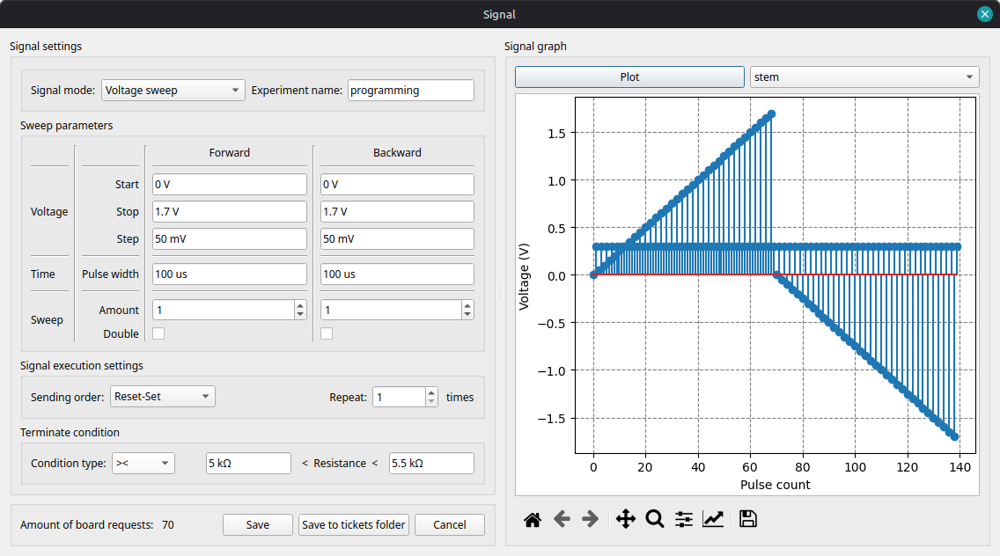

Set and reset signals can be controlled independently in the top half of the window: the pulse amplitudes (in volts) and widths (**Time: ms and μs**) can be adjusted. The **Amound** field specifies the amount of set or reset sweeps in a set-reset cycle, the **Repeat** fields specifies the total amount of set-reset cycles. If the **Dec** flag is off, the voltage sweeps from **Start** to **Stop** with the specified **Step**. If the **Dec** flag is on, the voltage also sweeps from **Stop** to **Start**.
For example, measuring 10 IV curves requires the following parameters:

|            |Start| Stop| Step | Quantity |Decrement| Time, ms| Time, μs |
|------------|-----|-----|------|----------|---------|---------|----------|
| **Reset**  | 0.0 | 1.6 | 0.05 |     1    |    +    |    0    |    100   |
|  **Set**   | 0.0 | 1.2 | 0.05 |     1    |    +    |    0    |    100   |

**Sending order:** Reset-Set; **Repeat**: 10 times

#### Standart pulse sequence

Each measurement point consists of two parts &mdash; a voltage pulse with the adjustable amplitude for changing the resistive state of the cell, and a read pulse that always follows it. The amplitude of the reading pulse is fixed in the *settings.ini* file.
During the experiment, the resistive state of the cell is controlled only via read pulses with constant amplitude.

#### Terminate condition

The terminate condition can be specified in the [Signal editing window](#signal-editing-window) and ***it is checked after every measurement point is acquired***. The **pass** condition turns the terminator off. For other condition values, you need to enter the resistance in the **Value** field (or **Min** and **Max** fields), and it will be compared to the acquired resistance.
For example, the [Signal editing window figure](#signal-editing-window) shows standart terminate condition for programming resistive states via ***write-verify algorithm***: the **condition** is set to **><**. The experiment (for this ticket only) will automatically stop when the resistance of the memory cell will be from 5000 to 5500 Ohm.
You can increase the amount of set-reset cycles to ensure that the memristive cell reaches the desired resistance range.
You can add other tickets after the programming ticket (for example, a retention ticket) to create an autonomous experiment.

## Applying the experiment

The **Apply** window can be opened from [Experiment configuration window](#configuring-your-experiment), via **Apply to the cell** button.

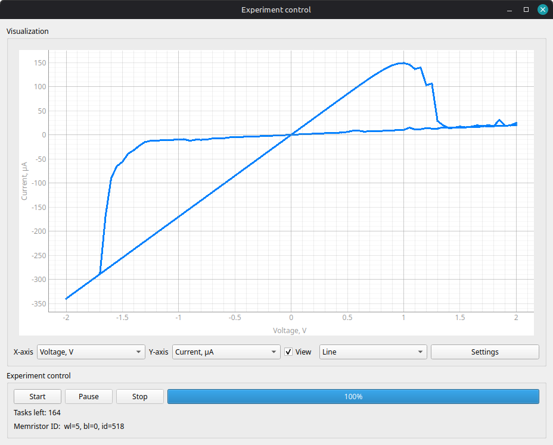

In the Apply window, there is a **Visualizaion** field where the data acquired during the experiment is displayed. You can adjust the figure via left-click (moves the plot) and right-click (opens plot settings menu).
For example, you can set the **logarithmic scale** for the plot by opening plot menu (right-click) &rarr; Plot Options &rarr; Transforms &rarr; log Y.
In the bottom part of the window, you can set the data which will be displayed during the experiment: **X-axis** can display *Counts* (number of pulses applied to the cell) or *Voltage*. **Y-axis** can display *resistance*, *current* or *ADC values*. You can scroll through the display options via scroll wheel on your mouse.
The line style of the plot can be selected from *Line*, *Dots* or *Stars*.
In the bottom of the window there is an **Experiment control** panel. You can **Start**, **Pause** or **Stop** the experiment from there.
After the experiment is completed, a notification of completion will be shown. In the event of reaching the [software current compliance](#settings), warning will be shown.

## Testsing multiple cells

The **Testing window** is opened via **Tests** button on the [Main window](#main-window). In it, you can configure an experiment an apply it to multiple cells.

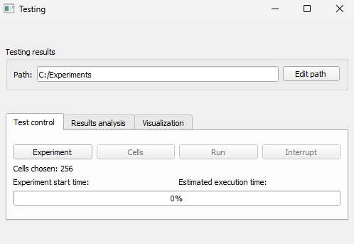

To conduct an experiment on multiple cells, proceed with the following steps:

1. Set the **Path** to the folder where the test results will be saved (**Edit path** button). The results will be automatically exported in that folder during the experiment. Note: it's best to create a new experiment folder for each multicell test.
2. In lower part of the window, in test **Test control** tab, press the **Experiment** button. The [History](#history-window) window will be opened. In it, you choose one of the previously applied experiments and **Load** it to the [Experiment plan](#configuring-your-experiment). When you are finished with configuring the experiment plan, press **Apply to all cells** button.
3. On the **Testing** window, you can select the cells to which the experiment will be applied, or apply it to all cells in the crossbar array. To specify the cells, create a *.csv* file, following the example below. The file contains two columns which specify volumn (wl) and row (bl) of the cells. Each row of the file should contain coordinates of cells for which the experiment is applied. To load the file, click **Cells** button on the **Testing** window.
4. To run the rest, click **Run** button. The confirmation window will appear, which displays extimated time of the experiments (The estimation is not correct for some boards, it's work-in-progress). The test will start when you press **Yes** button. The visualization is not provided for this mode, but you can check the progress via the progressbar or by checking the contents of the folder with experiment results.

Example of a file specifying the cells for which the experiment is applied:

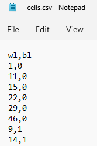

### Result analysis

After the experiment is done, you can analyse the results:

1. Open **Result analysis** tab on the **Testing** window.
2. The program calculates maximum (**Rmax**) and minimum (**Rmin**) resistance recorded during the experiment for each cell. Choose one or several conditions (logical *and* is applied when choosing multiple conditions) for the resistances or their ratio and press **Calculate**.
3. The program will calculate the amount of cells that satisfy the conditions.
4. In the folder with experiment results, a new folder with analysis results will be created. In it, there are lists of good and bad cells (good cells satisfy the condition) and a result map.

### Visualization

After the experiment is done, you can automatically generate plots of the results:

1. Open **Visualization** tab on the **Testing** window.
2. Choose which data will be displayed on X-axis and Y-axis.
3. Press **Generate plots** button.
4. In the experiment folder, a new folder with images will be created.

<!-- 
### Инференс нейросети

### Демо нейросети -->