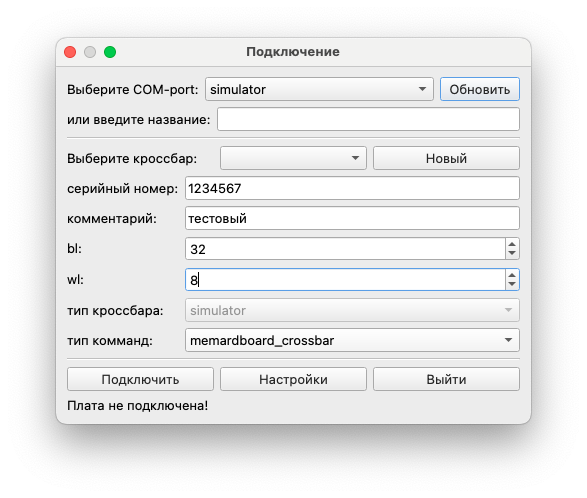
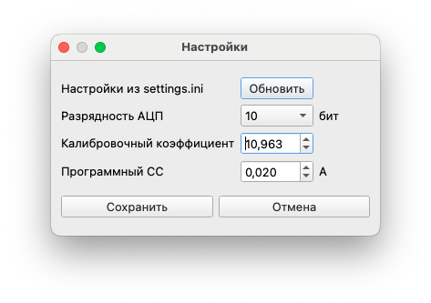
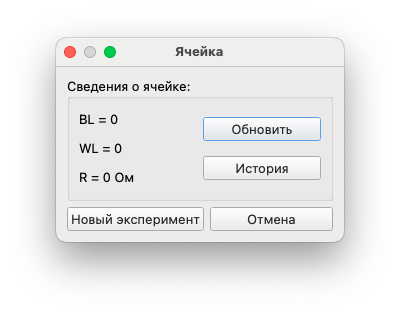
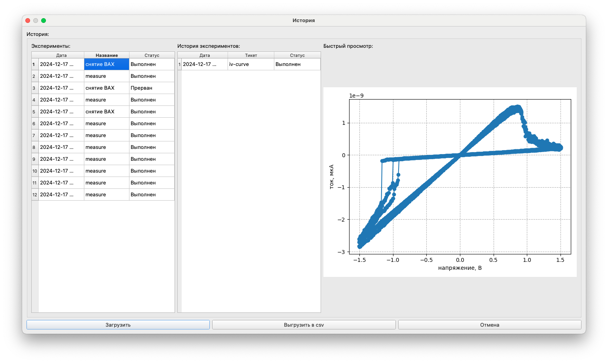
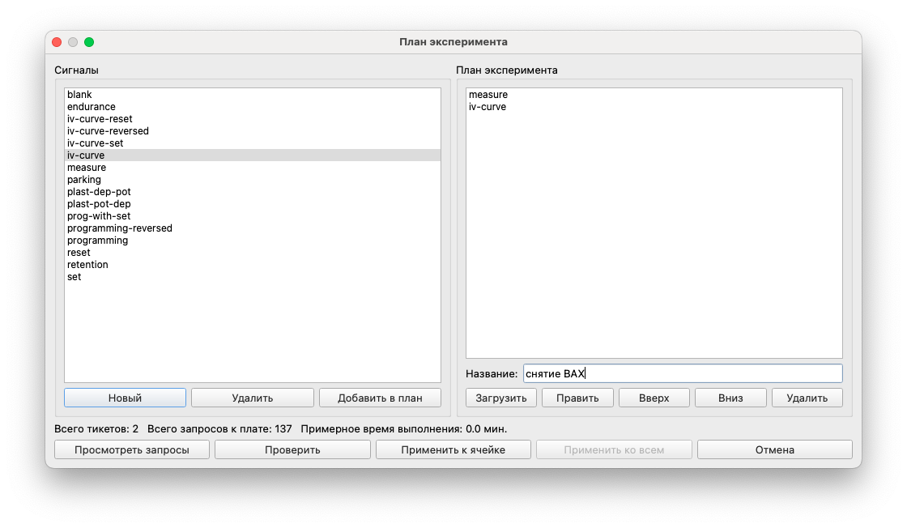
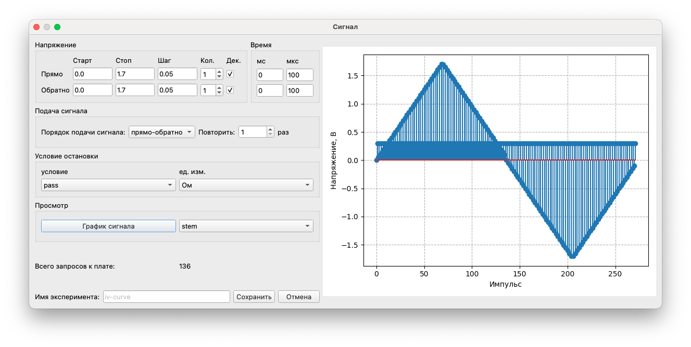

## Оглавление

- [Общие сведения о программе](#общие-сведения-о-программе)
- [Работа с ячейками](#работа-с-ячейками)
- [Инференс нейросети](#инференс-нейросети)
- [Демо нейросети](#демо-нейросети) 

### Общие сведения о программе

Программа может быть запущена на любой операционной системе c поддержкой python 3.9 и выше.
 

При запуске появляется стартовое окно. В нём можно выбрать COM порт, к которому подключено устройство, или выбрать режим програмной симуляции устройства:
 

###### Стартовое окно подключения

Есть возможность добавлять несколько кроссбаров, в случае, если устройство используется с разными кроссбарами. Для каждого из них создается отдельный журнал истории взаимодействия.

При добавлении кроссбара вводится его серийный номер, количество строк и столбцов в кроссбаре (применимо для различных архитектур и экспериментального подключения), тип комманд (с коммутацией, без коммутации), тип кроссбара, и при надобности комментарий:

###### Окно создания кроссбра

После подключения в памяти создается новый кроссбар, или загружается уже имеющийся, и открывается окно просмотра и взаимодействия. 

##### Главное окно

- RRAM для работы с памятью.
- Математика для выполнения матричного умножения. 
- ИНС для работы с нейронными сетями
- Тесты для проведения общего тестирования кроссбара.
- Снапшот сожерит цветовую карту кроссбара.
- ###### Настройки 
    - Функционал обновления конфигурации из файла settings.ini.
    - Выбор разрядности АЦП (10 бит (контроллер) и 14 бит (внешний АЦП, оверсемплинг)).
    - Регулировку калибровочного коэффициента. 
    - Регулировку програмного ограничителя тока (методом прогнозирования тока следующего импульса, иходя из полученых данных).  

- "Реконнект" позволяет переподключится к плате при нештатном разрыве соединения без перезапуска программы, или используется для перезагрузки контроллера.  

### Работа с ячейками

Кроме общего функционала присутствует возможность работать с каждой ячейкой отдельно. Для открытия меню ячейки  щелкните по ней два раза левой кнопкой мыши. 

###### Окно ячейки кроссбара

В открывшемся окне отображается основная информация о ячейке, и присутствует базовый функционал для работы с ней:

- "Обновить" - чтение сопротивления ячейки.
- ###### "История" 
    Открывает окно, в котором отображены все действия, выполняемые с ячейкой. 
    Окно разделено на 3 столбца:
    - Действие с ячейкой.
    - Список экспериментов в выбранном действии.
    - График результата проведенного эксперимента.
    - Кнопка "Загрузить" позволяет повторно загрузить входные данные эксперимента для его [повторения](#окно-редактирования-сигнала). 
    - Кнопка "Выгрузить в CSV" создает в корне директории программы CSV файл с каждой точкой результата эксперимента.
    - Кнопка "Отмена" закрывает окно истории.
    
- "Новый эксперимент" - открывает окно создания эксперимента.
Позволяет создать новый эксперимент с ячейкой. Он составляется из предустановдленных сигналов, присутствует возможность добавить свой вид сигнала, для этого нужно нажать кнопку "Новый. Для добавления сигнала в эксперимент нужно выбрать сигнал и кликнуть два раза левой кнопкой мыши, или нажать кнопку "Добавить в план". 
Справа расположен столбец с планом эксперимента, где расписана последовательность сигналов. При необходимости можно править параметры сигнала, переместить его относительно остальных, или удалить. После настройки параметров необходимо ввести название эксперимента.
###### Окно редактирования сигнала

При редактировании сигнала, или создании нового, открывается окно редактирования сигнала. Каждый сигнал аппаратно состоит из двух частей - настраиваемый импульс воздействия на ячейку, и импульс считывания состояния ячейки. Импульс взаимподействия имеет настройки амплитуды, длительности, и порядок подачи сигнала в случае его множественности. Сигнал может быть как прямой(reset), так и обратный (set). Присутсвует возможность задать причину прерывания сигнала и предварительный просмотр его графика. Старт, стоп и шаг указываются в Вольтах.
Например, для снятия ВАХ ячейки, Указываются такие параметры: 

|       |Старт|Стоп|Шаг |Количество|Декремент|МС|МКС|
|-------|-----|----|----|----------|---------|--|---|
|Прямо  |0.0  |1.6 |0.05|     1    |    +    | 0|100|
|Обратно|0.0  |1.2 |0.05|     1    |         | 0|100|

*Подача сигнала: прямо-обратно; Повторить: 1 раз*

###### Результат настройки сигнала:

Для запуска созданного эксперимента необходимо нажать кнопку "Применить к ячейке" для применения к выбранной ячейке, или "Применить ко всем" для применения ко всем ячейкам. 
После этого откроется окно проведения эксперимента. Оно содержит: 
- Поле отрисовки графика. Есть возможность изменить отображаемые по осям данные и изменить метод отображения (точки, линия). Если отрисовка графика в реальном времени не требуется, реккомендуется выключить настройку "Отображение" ниже. 
- Панель управления экспериментом. Кнопки запуска, паузы и остановки эксперимента, а так же шкала прогресса проведения эксперимента.
После выполнения эксперимента будет показано уведомление о завершении, и в случае срабатывания программного [ограничителя тока](#настройки) 

### Инференс нейросети

### Демо нейросети