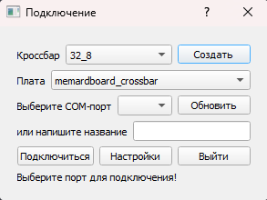
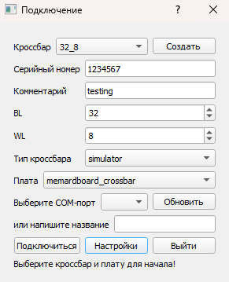
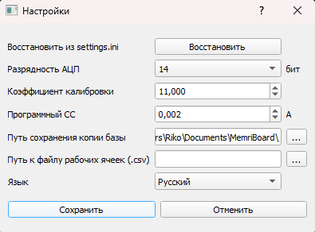
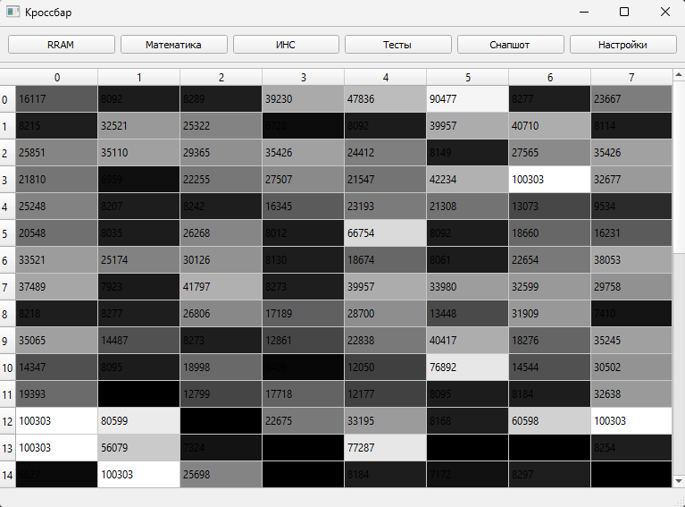
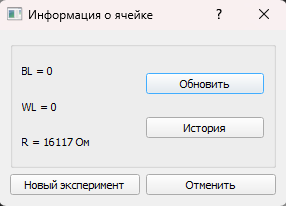
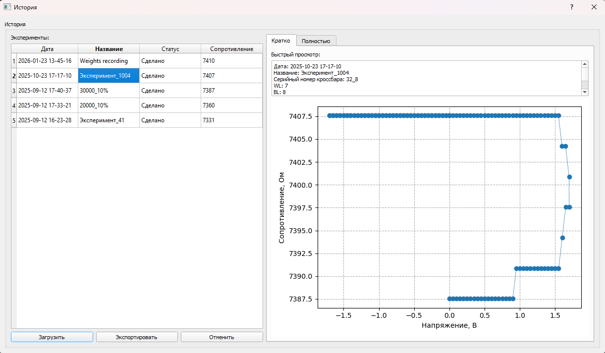
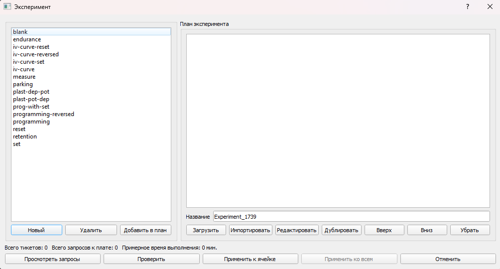
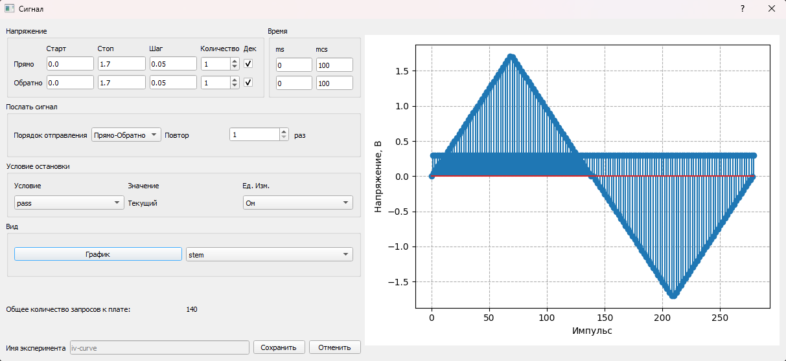
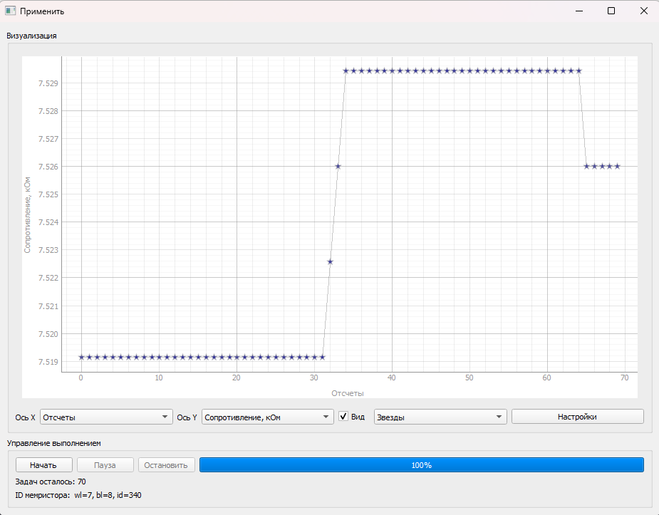
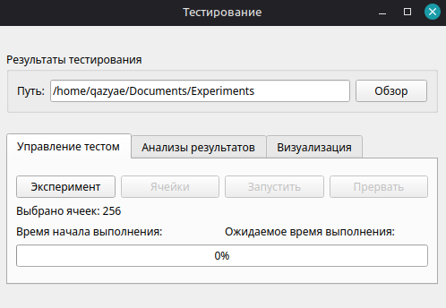

# Руководство пользователя MemriBoard

## Содержание

- [**Общие сведения о программе**](#общие-сведения-о-программе)
- [**Подключение измерительного устройства**](#подключение-измерительного-устройства)
  - [Добавление нового кроссбара](#добавление-нового-кроссбара)
    - [Настройки](#настройки)
- [**Главное окно**](#главное-окно)
  - [Дополнительный функционал](#другие-функции-главного-окна)
- [**Работа с отдельными ячейками**](#работа-с-отдельными-ячейками)
  - [Окно истории ячейки](#окно-истории-ячейки)
- [**Конфигурация эксперимента**](#конфигурация-эксперимента)
  - [Редактирование сигнала](#окно-редактирования-сигнала)
    - [Стандартная последовательность импульсов](#стандартная-последовательность-импульсов)
    - [Условие остановки](#условие-остановки)
- [**Проведение эксперимента**](#проведение-эксперимента)
- [**Выполнение теста на нескольких ячейках**](#выполнение-теста-на-нескольких-ячейках)

## Общие сведения о программе

Программа может быть запущена на любой операционной системе c поддержкой python 3.9 и выше.

### Подключение измерительного устройства

При запуске появляется стартовое окно. В нём можно выбрать название кроссбара, с которым ведется работа, COM-порт, к которому подключено устройство, или выбрать режим программной симуляции:

Есть возможность добавлять несколько кроссбаров, в случае, если устройство используется с разными кроссбарами. Для каждого из них создается отдельный журнал истории взаимодействия.

#### Добавление нового кроссбара

При добавлении кроссбара вводится его серийный номер, количество строк (**BL** &mdash; Bit Line) и столбцов (**WL** &mdash; Word Line) в кроссбаре (применимо для различных архитектур и экспериментального подключения), тип команд (с коммутацией, без коммутации), тип кроссбара (симулятор или реальный), и при необходимости, комментарий.

Если добавляется настоящий кроссбар, то сначала необходимо подключить устройство к USB порту, и в поле "Выберете COM порт" указать имя порта.  
После подключения в памяти создается новый кроссбар, или загружается уже имеющийся, и открывается окно просмотра и взаимодействия.

#### Настройки

- Функционал **обновления конфигурации** из файла settings.ini.
- Выбор **разрядности АЦП** (10 бит (АЦП Arduino) и 14 бит (внешний АЦП, оверсемплинг)).
- Регулировка **калибровочного коэффициента**.
- Регулировка **программного ограничителя тока** (методом прогнозирования тока следующего импульса, исходя из полученных данных).

## Главное окно

- **RRAM** для работы с кроссбаром как с банком памяти.
- **Математика** для выполнения матричного умножения.
- **ИНС** для работы с нейронными сетями (в работе).
- [**Тесты**](#выполнение-теста-на-нескольких-ячейках) для проведения общего тестирования кроссбара.
- **Снапшот** содержит цветовую карту сопротивлений ячеек в кроссбаре. Из этого окна можно экспортировать матрицу с сопротивлениями кроссбара с помощью кнопки **Экспорт данных**.
- [**Настройки**](#настройки).
- **Другое (...)** показывает [остальные функции](#другие-функции-главного-окна), доступные на главном окне.

### Другие функции главного окна

По клику на кнопку `...` в правом верхнем углу главного окна можно вызвать функции, для которых доступны горячие клавиши:

- `Ctrl+T` &mdash; открыть терминал.
- `Ctrl+M` &mdash; показать веса в кроссбар-матрице.
- `Ctrl+I` &mdash; показать информацию о кроссбар-матрице.
- `Ctrl+B` &mdash; открыть окно **записи весов в кроссбар**.
- `Ctrl+U` &mdash; **прочитать все сопротивления** в кроссбар-матрице.
- `F1` &mdash; открыть это руководство.

## Работа с отдельными ячейками

Кроме общего функционала присутствует возможность работать с каждой ячейкой отдельно. Для открытия меню ячейки  щелкните по ней два раза левой кнопкой мыши.

В открывшемся окне отображается основная информация о ячейке, и присутствует базовый функционал для работы с ней:

- **Обновить** &mdash; чтение сопротивления ячейки.
- [**История**](#окно-истории-ячейки) &mdash; открывает окно, в котором отображены все действия, выполняемые с ячейкой.
- [**Новый эксперимент**](#конфигурация-эксперимента) &mdash; открывает окно создания плана эксперимента.

### Окно истории ячейки

В окне отображены все действия, выполняемые с ячейкой. Кликнув на эксперимент в левой части окна, можно посмотреть краткую сводку эксперимента (вкладка **Кратко** в правой части окна) или ***экспортировать результаты измерения*** в файл .csv (перейдите на вкладку **Полностью** в правой части окна, затем нажмите **Выгрузить в csv**).
Вы можете экспортировать план эксперимента как единый тикет при помощи кнопки **Экспортировать** в левой нижней части окна.
Вы можете **Загрузить** эксперимент (кнопка в левой нижней части окна), чтобы повторить его: откроется окно [конфигурации эксперимента](#конфигурация-эксперимента).

## Конфигурация эксперимента

Окно конфигурации эксперимента может быть открыто через окно [информации о ячейке](#работа-с-отдельными-ячейками) или через окно [Тесты](#выполнение-теста-на-нескольких-ячейках).

Окно позволяет создать новый эксперимент с ячейкой. Он составляется из тикетов &mdash; предустановленных сигналов, например, iv-curve, endurance, programming, и т. д. В план эксперимента можно добавить несколько тикетов из левой части окна (кнопка **Добавить в план**), или создать новый тике (кнопка **Новый** в левом нижнем углу).
Кнопка **Загрузить** в правой части окна позволяет загрузить эксперимент, который ранее был применен к одной из ячеек. Все параметры тикетов, составляющих эксперимент, будут сохранены.
Доступен **импорт** тикетов из файлов *.json*.
В правой части окна можно ввести **название эксперимента**, оно будет отображаться в истории ячейки.

По умолчанию в приложении доступны следующие тикеты:

- *blank* &mdash; пустой тикет. На его основе можно создать свой.
- *endurance* &mdash; стандартный тест на выносливость при импульсном переключении для мемристорных ячеек памяти.
- *iv-curve*, *iv-curve-set*, *iv-curve-reset*, *iv-curve-reversed* &mdash; тикеты для измерения вольт-амперных характеристик.
- *measure* &mdash; тикет для измерения сопротивления ячейки.
- *programming*, *programming-reversed* &mdash; для программирования необходимого резистивного состояния (см. [Условие остановки](#условие-остановки)).
- *retention* &mdash; тикет для измерения длительности удержания логических состояний.
- *plast-dep-pot*, *plast-pot-dep* &mdash; тикеты для изучения потенциации и депрессии мемристорных ячеек.

На основе тикетов также можно построить сложные алгоритмы, выполняют различные тикеты в зависимости от параметров мемристора, измеренных в процессе эксперимента. Инструкция к функционалу алгоритмов доступна в [документации](algorithms_rus.md).

### Окно редактирования сигнала

Окно открывается из [плана эксперимента](#конфигурация-эксперимента) и позволяет настроить сигнал, который применяется к мемристорной ячейке в рамках одного тикета.

Амплитуды импульсов set и reset контролируются независимо в верхней части окна: задается амплитуда импульса (в вольтах) и его ширина (время в мс и мкс). Поле **Количество** позволяет указать количество разверток set или reset в рамках одного цикла set-reset. Поле **Повтор** задает количество циклов set-reset. Если флаг **Дек** выключен, развертка проходит от напряжения **Старт** до напряжения **Стоп** с заданным **Шагом**. Если флаг **Дек** включен, развертка также идет от **Стоп** до **Старт**.
Кнопка **График** позволяет посмотреть график сигнала.
Например, измерение 10 вольт-амперных характеристик можно провести следующими параметрами:

|             |Старт| Стоп|  Шаг | Количество |Декремент|Время, мс|Время, мкс|
|-------------|-----|-----|------|------------|---------|---------|----------|
|  **Прямо**  | 0.0 | 1.6 | 0.05 |     1      |    +    |    0    |    100   |
| **Обратно** | 0.0 | 1.2 | 0.05 |     1      |    +    |    0    |    100   |

**Подача сигнала**: прямо-обратно; **Повторить**: 10 раз

#### Стандартная последовательность импульсов

Каждая точка измерения состоит из двух частей &mdash; импульса напряжения с настраиваемой амплитудой для изменения резистивного состояния ячейки, и импульса чтения, следующего за ним. Амплитуда импульса чтения задается в файле *settings.ini*. Амплитуда переключающих импульсов задается в [окне редактирования сигнала](#окно-редактирования-сигнала).
Во время эксперимента сопротивление ячейки контролируется только импульсами чтения постоянной амплитуды.

#### Условие остановки

Условие остановки тикет может быть задано в [окне редактирования сигнала](#окно-редактирования-сигнала), оно проверяется ***при получении каждой точки измерения***. Условие **pass** выключает условие остановки. Для других условий необходимо ввести условие в поле **Значение** (или полях **Мин** и **Макс**), оно будет сравниваться с **текущим** значением сопротивления.
Например, на [рисунке с окном редактирования сигнала](#окно-редактирования-сигнала) демонстрируется стандартное условие остановки для программирования резистивных состояний ***алгоритмом write-verify***: установлено **Условие** **><**. Эксперимент (только для этого тикета) автоматически остановится, когда сопротивление ячейки окажется в диапазоне от 5000 до 5500 Ом.
Для повышения вероятности успешного программирования ячейки можно увеличить количество циклов set-reset.
После тикета программирования можно добавить другие тикеты (например, retention) для создания автономного эксперимента.

## Проведение эксперимента

Окно проведения эксперимента открывается из [окна конфигурации эксперимента](#конфигурация-эксперимента) при помощи кнопки **применить к ячейке**.

Окно содержит поле отрисовки графика. Если отрисовка графика в реальном времени не требуется, можно его выключить (флаг **Вид**).
Сдвиг области отрисовки осуществляется левой кнопкой мыши. По нажатию на правую кнопку мыши открывается меню с настройками отображения. К примеру, можно установить **логарифмический масштаб** графика открытием меню &rarr; Plot Options &rarr; Transforms &rarr; log Y.
В нижней части окна можно выбрать, данные, отображаемые во время эксперимента: **Ось X** может показывать *Отсчеты* (номер импульса) или *Напряжение*. **Ось Y** может отображать *Сопротивление*, *Ток* или *Отсчеты АЦП*. Эти настройки можно также изменять колесиком мыши.
Есть возможность изменить отображаемые по осям данные и изменить метод отображения (*точки*, *линия*, *звёздочки*).
В нижней части окна располагается **панель управления экспериментом**. Здесь находятся кнопки начала, паузы и остановки эксперимента.
После выполнения эксперимента будет показано уведомление о завершении. В случае срабатывания программного [ограничителя тока](#настройки) будет показано предупреждение.

## Выполнение теста на нескольких ячейках

Окно Тесты открывается при помощи кнопки **Тесты** на [Главном окне](#главное-окно). В нем можно сконфигурировать эксперимент и применить его к нескольким ячейкам.

Для проведения теста на нескольких ячеек необходимо выполнить следующие действия:

1. Установить **Путь** к папке, куда будут сохранены результаты теста (кнопка **Обзор**). Результаты экспериментов будут автоматически экспортироваться в эту папку во время проведения теста. Лучше всего создавать отдельные папки для каждого теста на множество ячеек.
2. В нижней части окна, во вкладке **Управление тестом**, нажмите кнопку **Эксперимент**. Откроется [окно истории](#окно-истории-ячейки). В нем необходимо выбрать один из ранее проведенных экспериментов и **загрузить** его в [план эксперимента](#конфигурация-эксперимента). Далее в окне плана можно редактировать эксперимент. После этого необходимо нажать кнопку **Применить ко всем**.
3. В окне **Тесты** можно выбрать ячейки, для которых будет проведен эксперимент, или применить его ко всем ячейкам в кроссбар-матрице. Чтобы указать ячейки, создайте файл *.csv* согласно примеру ниже. Файл должен содержать две колонки, задающие столбец (wl) и строку (bl) ячеек. Каждая строка должна содержать координаты ячеек, для которых выполняется тест. Для загрузки файла нажмите кнопку **Ячейки** на окне Тесты.
4. Для запуска теста нажмите кнопку **Запустить**. Появится окно подтверждения с расчетным временем эксперимента (расчет времени на данный момент работает некорректно для некоторых видов измерительного оборудования). Тест начнется по нажатии кнопки **Да** на подтверждающем окне. Визуализация во время эксперимента не поддерживается в этом режиме, но доступна шкала выполнения тестов. Проверить выполнение также можно заглянув в папку с результатами: там появляются файлы после завершения эксперимента на каждой ячейке.

Пример файла, задающего ячейки, к которым применяется эксперимент:

### Анализ результатов

После окончания эксперимента можно проанализировать результаты:

1. Откройте вкладку **Анализ результатов** на окне **Тесты**.
2. Программа рассчитывает максимальное (**Rmax**) и минимальное сопротивление (**Rmin**), зафиксированное на ячейке во время эксперимента. Выберите одно или несколько условий (при выборе нескольких применяется логическое *и*) для сопротивлений или их отношений и нажмите **Посчитать**.
3. Программа рассчитает количество ячеек, которые удовлетворяют условиям (**Подходящие**).
4. В папке с результатами эксперимента появится папка с результатами анализа. В ней находятся файлы с координатами ячеек, удовлетворяющих условиям (**good_cells**), с ячейками, не удовлетворяющими условиям (**bad_cells**), и карта кроссбара.

### Визуализация результатов

После окончания эксперимента можно сгенерировать графики с результатами:

1. Откройте вкладку **Визуализация** на окне **Тесты**.
2. Выберите данные, которые будут отображаться на осях X и Y.
3. Нажмите кнопку **Построить графики**.
4. В папке с результатами эксперимента появится папка с изображениями.
